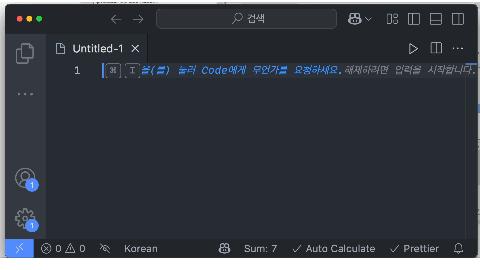

# Number Sum

A VS Code extension that calculates the sum of numbers in selected text.




## Features

- Calculate the sum of numbers in selected text
- Auto-calculate feature that updates the sum every 3 seconds when text is selected
- Toggle auto-calculate feature on/off
- Supports:
  - Line-by-line number separation
  - Ignores thousand separators (,)
  - Extracts numbers from text containing other characters

## Usage

1. Select text containing numbers
2. The sum will be automatically calculated and displayed in the status bar
3. If auto-calculate is disabled, use the command palette (Cmd+Shift+P) and type "Calculate Number Sum"
4. Toggle auto-calculate feature using the command palette and typing "Toggle Auto Calculate"

## Settings

- `numberSum.autoCalculate`: Enable/disable automatic calculation of number sums (default: true)

## Status Bar

- Shows the current sum of selected numbers
- Displays auto-calculate status with an icon
  - Check icon: Auto-calculate is enabled
  - Close icon: Auto-calculate is disabled

## Examples

```
1,234
567
abc789def
```

Result: Sum: 2,590

## Requirements

- VS Code version 1.98.0 or higher

## Extension Settings

This extension contributes the following settings:

- `numberSum.autoCalculate`: Enable/disable automatic calculation of number sums

## Icon

The extension uses a custom icon that represents the number sum functionality. The icon is located in the `images` directory and is displayed in:

- VS Code marketplace
- Extension view
- Command palette

## Known Issues

None at the moment.

## Release Notes

### 0.0.1

Initial release of Number Sum:

- Basic number sum calculation
- Auto-calculate feature
- Status bar integration
- Settings support

## Following extension guidelines

Ensure that you've read through the extensions guidelines and follow the best practices for creating your extension.

- [Extension Guidelines](https://code.visualstudio.com/api/references/extension-guidelines)

## Working with Markdown

You can author your README using Visual Studio Code. Here are some useful editor keyboard shortcuts:

- Split the editor (`Cmd+\` on macOS or `Ctrl+\` on Windows and Linux).
- Toggle preview (`Shift+Cmd+V` on macOS or `Shift+Ctrl+V` on Windows and Linux).
- Press `Ctrl+Space` (Windows, Linux, macOS) to see a list of Markdown snippets.

## For more information

- [Visual Studio Code's Markdown Support](http://code.visualstudio.com/docs/languages/markdown)
- [Markdown Syntax Reference](https://help.github.com/articles/markdown-basics/)

**Enjoy!**
